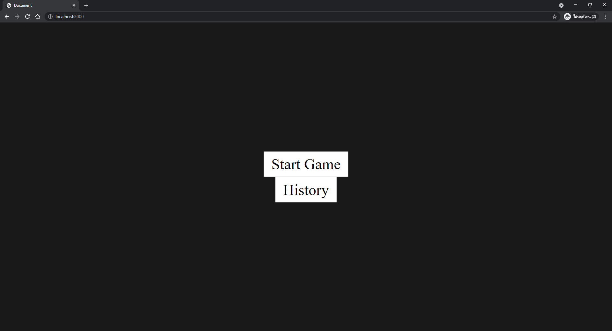
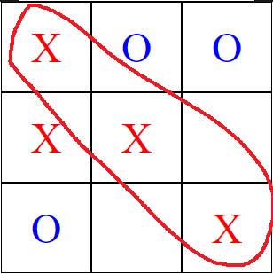
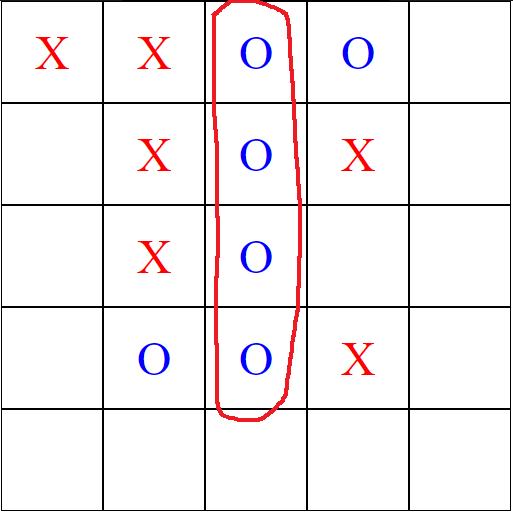
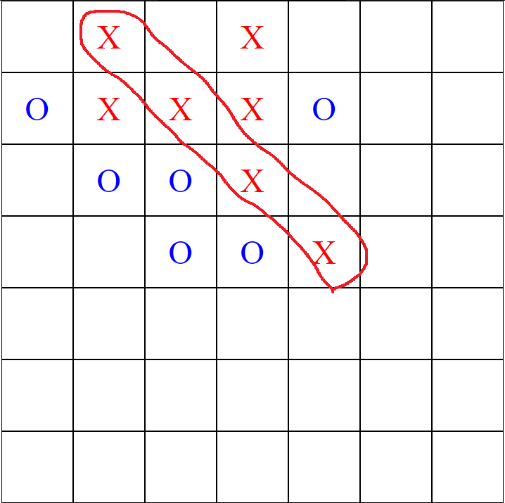

# XO-Game-by-Node.js
XO-Game for 2 Player

## Install (Node.js)
```
npm install express ejs method-override mongoose
```

## How to Run XO-Game (Node.js)
```
node index.js
```

## Start Game


## Use MongoDB 
** Start MongoDB for Recording Games **

## Design
- XO-Game for 2 Player
- Default Size 3x3 (where you have to place 3 consecutive to win)
- Extra Size 5x5, 7x7 (where you have to place 4 consecutive to win)
- Every time you play Playback will also be recorded.
- Every click will check the winning pattern.
- Can view play History

## Algorithm
1. winning pattern. (have 3 pattern)
  - Every click will Check the winning pattern.
  - Every click will Check is Draw from value
  - Is Winner or Uses an array to store playback position information.
  - Send Post for save to MongoDB
  
2. Swap X & O
  - Start Player is X
  - When Click Change X to O use innerText

3. Show Replay
  - get data from Database
  - use Array for position by for of
  - check if X , O , "" for display

## How to Win
### 3x3


### 5x5


### 7x7

